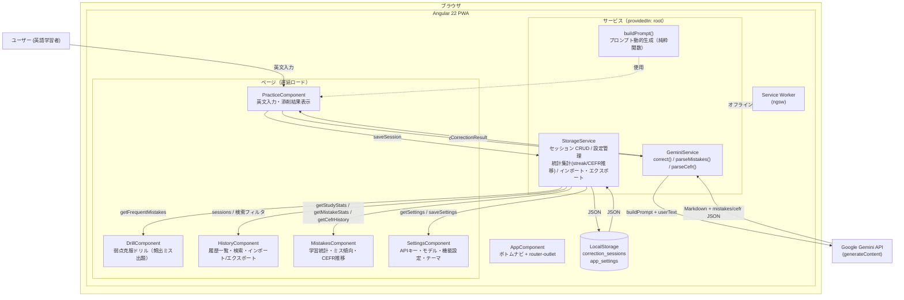
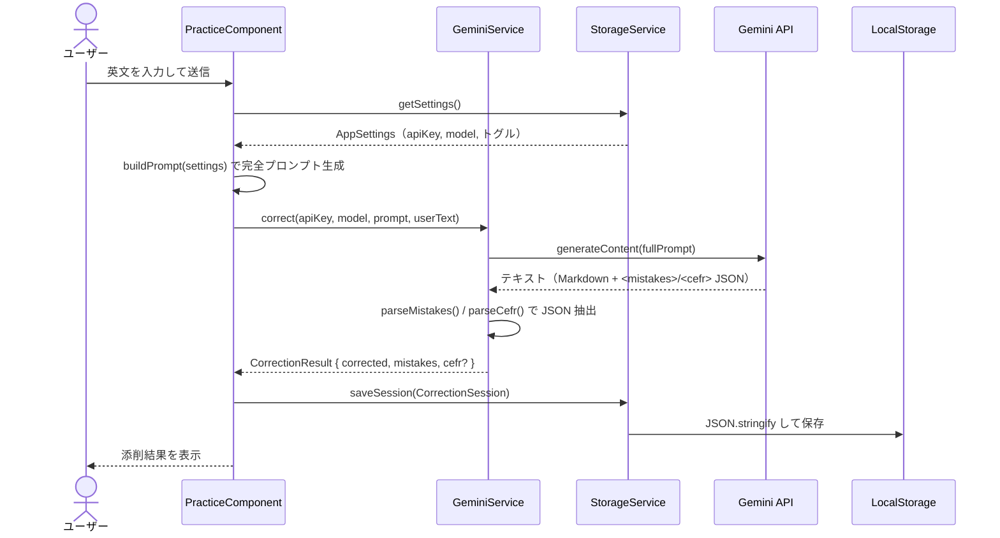
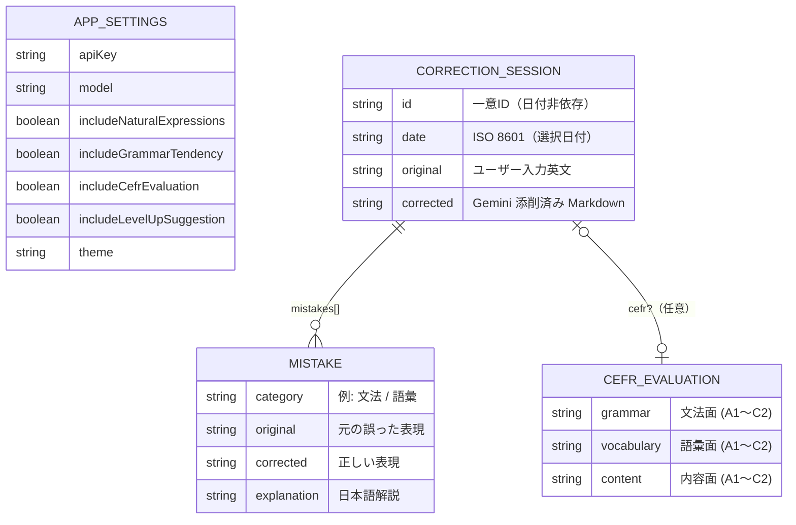
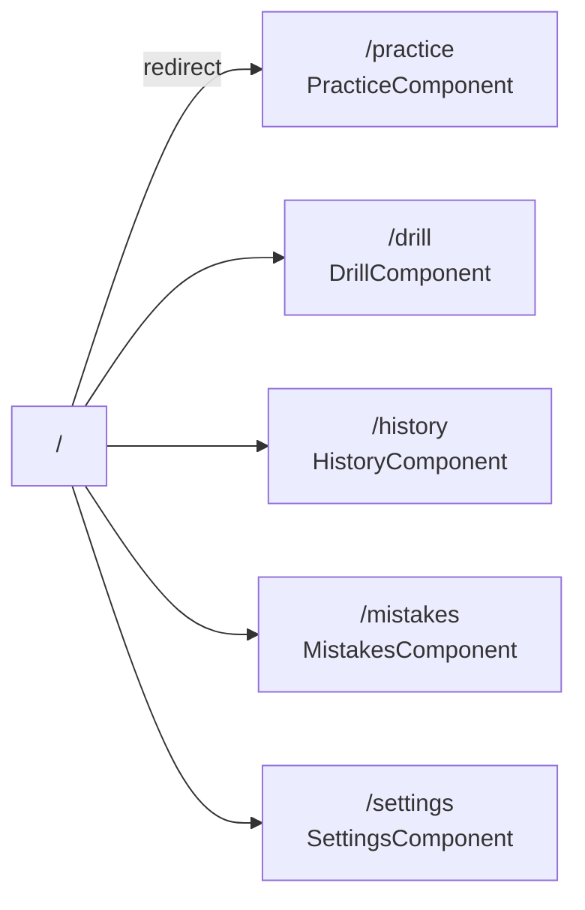
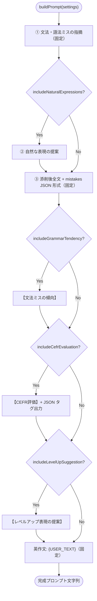

# ARCHITECTURE.md — Study English アーキテクチャ図

## アプリ全体構成

```mermaid
graph TD
    User["ユーザー (英語学習者)"]

    subgraph Browser["ブラウザ"]
        subgraph PWA["Angular 22 PWA"]
            App["AppComponent\nボトムナビ + router-outlet"]

            subgraph Pages["ページ（遅延ロード）"]
                Practice["PracticeComponent\n英文入力・添削結果表示"]
                Drill["DrillComponent\n弱点克服ドリル（頻出ミス出題）"]
                History["HistoryComponent\n履歴一覧・検索・インポート/エクスポート"]
                Mistakes["MistakesComponent\n学習統計・ミス傾向・CEFR推移"]
                Settings["SettingsComponent\nAPIキー・モデル・機能設定・テーマ"]
            end

            subgraph Services["サービス（providedIn: root）"]
                GeminiSvc["GeminiService\ncorrect() / parseMistakes() / parseCefr()"]
                StorageSvc["StorageService\nセッション CRUD / 設定管理\n統計集計(streak/CEFR推移) / インポート・エクスポート"]
                BuildPrompt["buildPrompt()\nプロンプト動的生成（純粋関数）"]
            end

            LocalStorage[("LocalStorage\ncorrection_sessions\napp_settings")]
            SW["Service Worker\n(ngsw)"]
        end
    end

    GeminiAPI["Google Gemini API\n(generateContent)"]

    User -->|英文入力| Practice
    Practice -->|correct| GeminiSvc
    GeminiSvc -->|buildPrompt + userText| GeminiAPI
    GeminiAPI -->|Markdown + mistakes/cefr JSON| GeminiSvc
    GeminiSvc -->|CorrectionResult| Practice
    Practice -->|saveSession| StorageSvc
    StorageSvc -->|JSON| LocalStorage
    LocalStorage -->|JSON| StorageSvc
    StorageSvc -->|sessions / 検索フィルタ| History
    StorageSvc -->|getFrequentMistakes| Drill
    StorageSvc -->|getStudyStats / getMistakeStats / getCefrHistory| Mistakes
    StorageSvc -->|getSettings / saveSettings| Settings
    BuildPrompt -.->|使用| Practice
    SW -->|オフラインキャッシュ| PWA
```

---

## データフロー（添削シーケンス）

```mermaid
sequenceDiagram
    actor User as ユーザー
    participant P as PracticeComponent
    participant G as GeminiService
    participant S as StorageService
    participant API as Gemini API
    participant LS as LocalStorage

    User->>P: 英文を入力して送信
    P->>S: getSettings()
    S-->>P: AppSettings（apiKey, model, トグル）
    P->>P: buildPrompt(settings) で完全プロンプト生成
    P->>G: correct(apiKey, model, prompt, userText)
    G->>API: generateContent(fullPrompt)
    API-->>G: テキスト（Markdown + <mistakes>/<cefr> JSON）
    G->>G: parseMistakes() / parseCefr() で JSON 抽出
    G-->>P: CorrectionResult { corrected, mistakes, cefr? }
    P->>S: saveSession(CorrectionSession)
    S->>LS: JSON.stringify して保存
    P-->>User: 添削結果を表示
```

---

## LocalStorage データ構造

```mermaid
erDiagram
    APP_SETTINGS {
        string apiKey
        string model
        boolean includeNaturalExpressions
        boolean includeGrammarTendency
        boolean includeCefrEvaluation
        boolean includeLevelUpSuggestion
        string theme
    }

    CORRECTION_SESSION {
        string id "一意ID（日付非依存）"
        string date "ISO 8601（選択日付）"
        string original "ユーザー入力英文"
        string corrected "Gemini 添削済み Markdown"
    }

    MISTAKE {
        string category "例: 文法 / 語彙"
        string original "元の誤った表現"
        string corrected "正しい表現"
        string explanation "日本語解説"
    }

    CEFR_EVALUATION {
        string grammar "文法面 (A1〜C2)"
        string vocabulary "語彙面 (A1〜C2)"
        string content "内容面 (A1〜C2)"
    }

    CORRECTION_SESSION ||--o{ MISTAKE : "mistakes[]"
    CORRECTION_SESSION |o--o| CEFR_EVALUATION : "cefr?（任意）"
```

---

## ルーティング

```mermaid
graph LR
    Root["/"] -->|redirect| Practice["/practice\nPracticeComponent"]
    Root --> Drill["/drill\nDrillComponent"]
    Root --> History["/history\nHistoryComponent"]
    Root --> Mistakes["/mistakes\nMistakesComponent"]
    Root --> Settings["/settings\nSettingsComponent"]
```

---

## プロンプト生成ロジック

```mermaid
flowchart TD
    Start(["buildPrompt(settings)"])
    S1["① 文法・語法ミスの指摘（固定）"]
    T1{includeNaturalExpressions?}
    S2["② 自然な表現の提案"]
    S3["③ 添削後全文 + mistakes JSON 形式（固定）"]
    T2{includeGrammarTendency?}
    A1["【文法ミスの傾向】"]
    T3{includeCefrEvaluation?}
    A2["【CEFR評価】+ <cefr>JSON タグ出力"]
    T4{includeLevelUpSuggestion?}
    A3["【レベルアップ表現の提案】"]
    S4["英作文: {USER_TEXT}（固定）"]
    End(["完成プロンプト文字列"])

    Start --> S1 --> T1
    T1 -->|Yes| S2 --> S3
    T1 -->|No| S3
    S3 --> T2
    T2 -->|Yes| A1 --> T3
    T2 -->|No| T3
    T3 -->|Yes| A2 --> T4
    T3 -->|No| T4
    T4 -->|Yes| A3 --> S4
    T4 -->|No| S4
    S4 --> End
```
