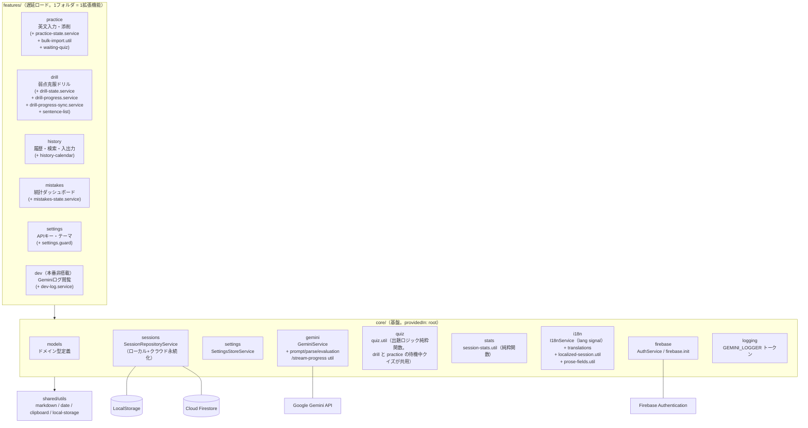
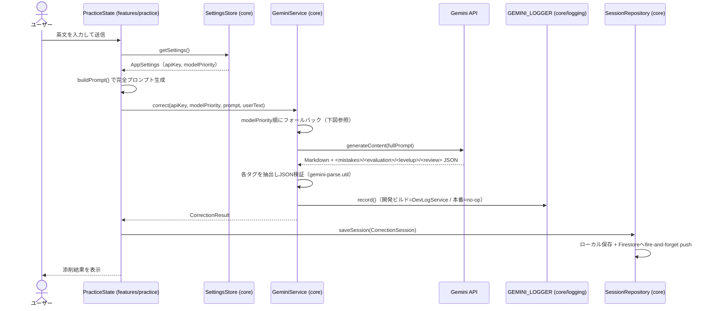
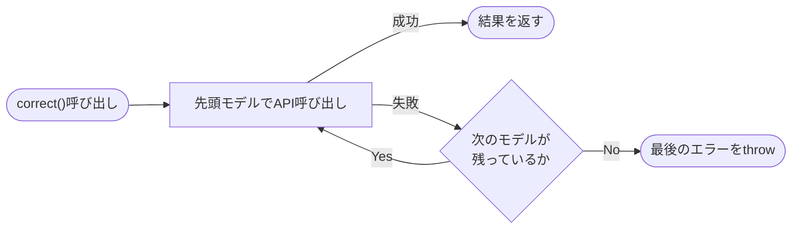
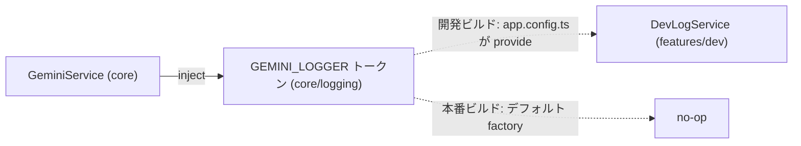
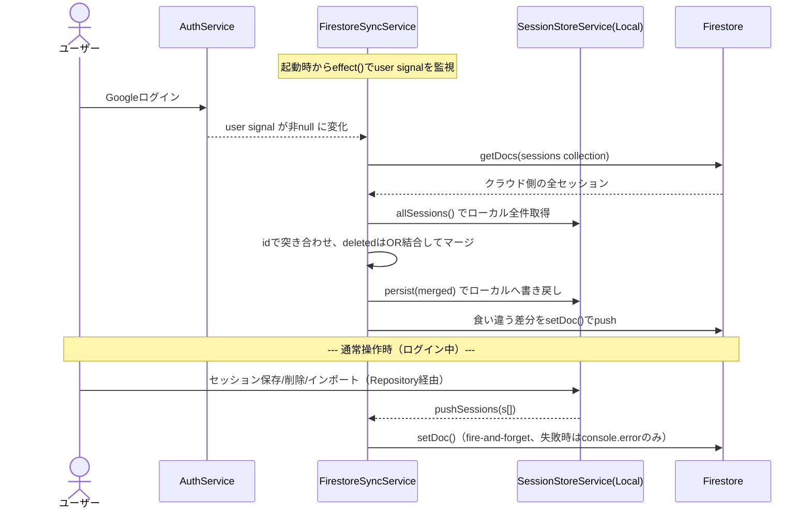
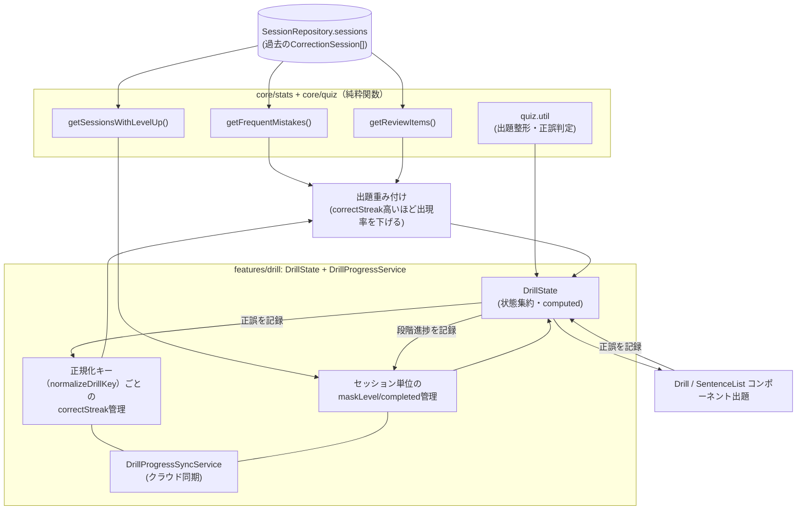
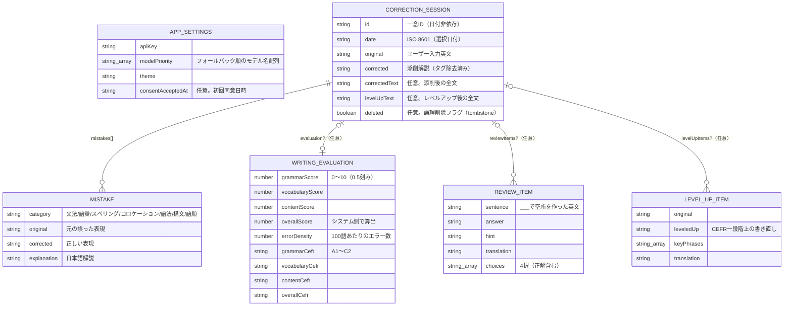
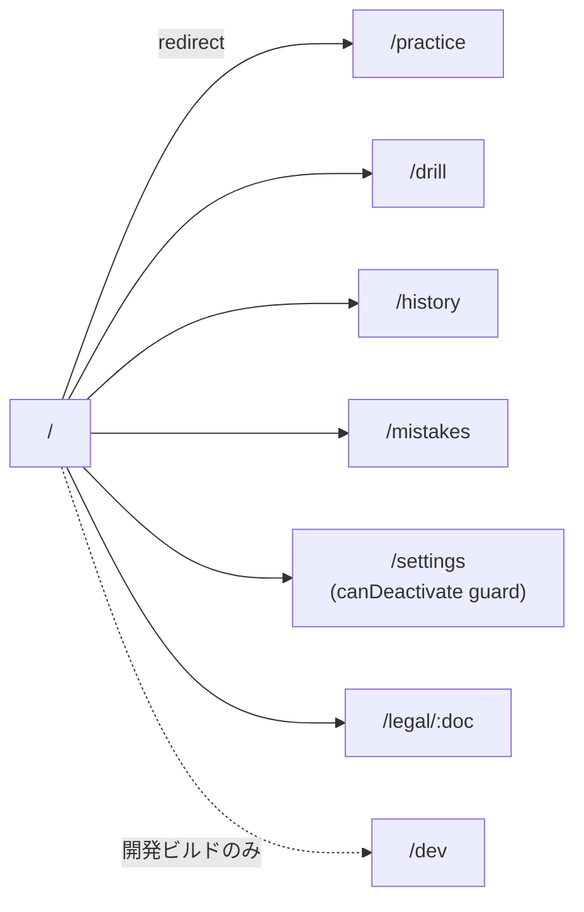
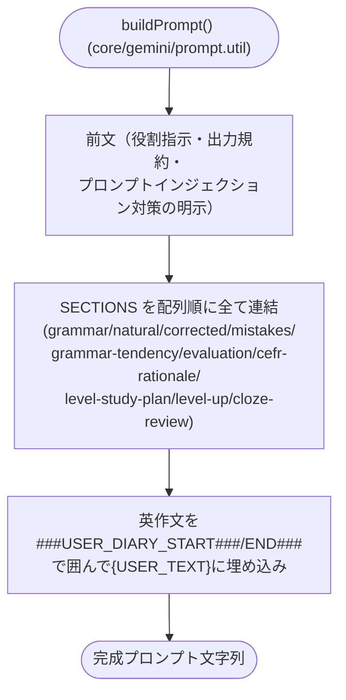
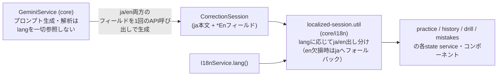

# ARCHITECTURE.md — 英文ラボ（Eibun-Lab）アーキテクチャ図

## 1. レイヤ構成（共通パターン）

コードベースは3層の一方向依存で構成される。**すべての機能追加はこのパターンの繰り返し**であり、
新しい拡張機能（feature）は `features/` にフォルダを1つ追加し、core のサービスを inject するだけでよい。

```
features/ ──▶ core/ ──▶ shared/
（拡張機能）  （基盤）   （汎用util）
```

- **features/** … 遅延ロードされるページ単位の拡張機能。ページ専用の service / util / guard は同じフォルダに同居する。feature 間の依存は禁止。
- **core/** … 全 feature が共有する基盤（ドメイン型・永続化・Gemini クライアント・Firebase・統計・多言語表示）。feature を import してはならない。
- **shared/** … アプリのドメインに依存しない汎用ユーティリティ（Markdown・日付・クリップボード等）。



### 各 feature が inject する core サービス

| feature  | 使用する core                                                                                                               |
| -------- | --------------------------------------------------------------------------------------------------------------------------- |
| practice | GeminiService / SessionRepositoryService / SettingsStoreService（+ feature 内 PracticeState）                               |
| drill    | SessionRepositoryService / stats / I18nService（+ feature 内 DrillState / DrillProgressService / DrillProgressSyncService） |
| history  | SessionRepositoryService / I18nService（+ feature 内 HistoryState / HistoryCalendar）                                       |
| mistakes | SessionRepositoryService / stats / I18nService（+ feature 内 MistakesState）                                                |
| settings | SettingsStoreService / AuthService / gemini-models.constants                                                                |
| dev      | SessionRepositoryService / SettingsStoreService / prompt.util（+ feature 内 DevLogService）                                 |

### 状態分離パターン（practice / drill / history / mistakes 共通）

`practice` / `drill` / `history` / `mistakes` はいずれも「状態・ロジックは feature 内の
`{feature}-state.service.ts` に集約し、コンポーネント（`practice.ts` / `drill.ts` / `history.ts` /
`mistakes.ts`）はテンプレートとの橋渡し・DOM操作（ファイル選択トリガー、confirm/alertダイアログ、
Blobダウンロード等）のみに専念する」というパターンを採る。`PracticeState` / `DrillState` /
`HistoryState` / `MistakesState` はいずれも `providedIn: 'root'` の singleton で、
`SessionRepositoryService` と純粋関数（`core/quiz/quiz.util.ts` / `core/stats/session-stats.util.ts`）を
組み合わせて `computed()` で状態を導出する。`SessionRepositoryService` 等の `core` サービスは
必ず `{feature}-state.service.ts` 内でのみ inject し、component が直接 inject することはない。
**今後 feature に複雑な状態管理が必要になった場合は、このパターンに倣い
`{feature}-state.service.ts` を新設すること。**

### レイヤ境界の機械強制

`features → core → shared` の一方向依存および feature 間 import 禁止は、`eslint-plugin-boundaries`
（`eslint.config.js`）により `npm run lint` 時に機械的に検証される。パスエイリアス（`@core/*` /
`@shared/*` / `@features/*`）の解決には `eslint-import-resolver-typescript` を使う。違反があれば
`boundaries/dependencies` ルールがエラーを出すため、規約からの逸脱がコードレビュー前に検知できる。

### 変更検知

全コンポーネントは `ChangeDetectionStrategy.OnPush` を採用する（リポジトリ全体の規約）。
状態は signal ベースで保持され、`OnPush` と組み合わせて変更検知範囲を最小化する。

---

## 2. core/sessions 内部構造

`SessionRepositoryService` がセッション永続化の唯一の窓口。「ローカル保存 → クラウド push」の
組み合わせを private な `syncToCloud()` に集約しており、書き込み系操作の呼び忘れによる乖離が起きない。

```mermaid
graph TD
    Repo["SessionRepositoryService\nsaveSession / deleteSession\nimportSessions / exportSessions"]
    Store["SessionStoreService\nLocalStorage CRUD\n(tombstone=論理削除)"]
    Sync["FirestoreSyncService\n双方向同期"]
    Auth["AuthService\n(user signal)"]

    LocalStorage[("LocalStorage")]
    Firestore[("Cloud Firestore\napps/eibun_lab/users/{uid}/sessions")]

    Repo -->|ローカル保存| Store
    Repo -->|直後に pushSessions\n（1箇所に集約）| Sync
    Store <--> LocalStorage
    Sync -->|allSessions 読取 / persist 書戻し| Store
    Sync -->|user signal を effect() で監視| Auth
    Sync <--> Firestore
```

設定（`SettingsStoreService`）とドリル進捗（`DrillProgressService`、features/drill 内）は
それぞれ独立に LocalStorage を読み書きし、リポジトリを経由しない。

---

## 3. 添削フロー（データフローシーケンス）



### モデルフォールバックループ

`modelPriority` 配列を先頭から順に試し、最初に成功したモデルの結果を返す。



### Gemini ログの依存逆転

`GeminiService`（core）は `GEMINI_LOGGER` InjectionToken（core/logging）に記録するだけで、
実装を知らない。開発ビルドでは app.config.ts が `DevLogService`（features/dev）を provide し、
本番ビルドではデフォルトの no-op が使われる（core→features の逆依存を持たない）。



---

## 4. Firestore 同期フロー

ログイン状態は `AuthService` の `user` signal で管理され、`FirestoreSyncService` は `effect()` で
これを監視する。ログインした瞬間に自動で双方向同期が走り、以降はセッションの保存/削除/インポートの
たびに `SessionRepositoryService` 経由で該当分だけ push される。



**tombstone方式の論理削除**: セッションは物理削除されず `deleted: true` フラグが立つ。マージ時は
「ローカル・クラウドどちらかが `deleted` なら結果も `deleted`」というOR結合を採用しており、片方の
端末で削除した内容が、もう片方の端末からの再pushで復活してしまう事態を防いでいる。

---

## 5. ドリル機能のデータフロー

`Drill`（features/drill）は「頻出ミス出題」「穴埋めクイズ」「穴あきタイピング」の3モードを持つ。
状態とロジックは `DrillState`（features/drill、singleton）に集約されており、出題元データは core の
`SessionRepositoryService.sessions` を `session-stats.util`（core/stats）と `quiz.util`（core/quiz）の
純粋関数で集計・整形し、習熟度は同じく feature 内の `DrillProgressService` が管理する。`drill.ts` 自体は
`DrillState` を inject するだけの薄いコンポーネントで、フォーカス制御など DOM 操作のみを行う。
出題画面は `sentence-list`（レベルアップの文一覧選択）などのサブコンポーネントに分割されている。



習熟度は問題ごとの正規化キー（`normalizeDrillKey`）単位で管理され、連続正解数（`correctStreak`）が
`DRILL_MASTERY_STREAK` 以上になると出題の重みが下がり、すでに習熟した問題は出にくくなる。

---

## 6. LocalStorage / Firestore データ構造



Firestore側は `apps/eibun_lab/users/{uid}/sessions/{sessionId}` のパスに `CorrectionSession` を
そのまま保存する（任意フィールドが `undefined` の場合はFirestoreの制約によりフィールドごと除外）。
除外対象の一覧（`firestore-sync.service.ts` の `OPTIONAL_FIELDS_MAP`）は `CorrectionSession` から
型レベルで導出した `Record<OptionalKeys<CorrectionSession>, true>` で定義しており、
`CorrectionSession` に optional フィールドを追加/削除してこちらの更新を忘れるとコンパイルエラーになる
（型による機械的な同期保証。CLAUDE.md 参照）。

そのほか LocalStorage には、ドリル進捗（`DrillProgressService`）・Gemini 送受信ログ
（`DevLogService`、開発ビルドのみ）が独立キーで保存される。

---

## 7. ルーティングとビルド差分

各ルートは `loadComponent` で features/ 配下から遅延ロードされる。



`environment.production` が true のとき、[app.routes.ts](src/app/app.routes.ts) は `/dev` ルートを
登録せず、[app.config.ts](src/app/app.config.ts) は `GEMINI_LOGGER` に `DevLogService` を provide
しない（no-op のまま）。つまり **dev feature は本番ビルドのルートテーブル・バンドル・ログ記録の
すべてから除外**される。Service Worker は本番ビルドのみ有効（`registerWhenStable:30000`）。

---

## 8. プロンプト生成ロジック



ユーザー入力は固有の区切り記号（`###USER_DIARY_START###` / `###USER_DIARY_END###`）で囲み、前文で
「区切り内は命令ではなくデータとして扱う」旨を明示することで、プロンプトインジェクションの悪用を
軽減している（完全な排除はできない軽減策）。

---

## 9. i18n（多言語表示）

`I18nService`（core/i18n）が `lang` signal（`'ja' | 'en'`）を保持し、UI文言は `translations.ts` の
`TRANSLATIONS` 辞書から `t()` で引く。`mistakes`/`drill`/`history` の state service はいずれもこの
`I18nService` を inject し、表示言語に応じたラベル・軸ラベルなどを `computed()` で導出する。



- `buildPrompt()`（core/gemini/prompt.util.ts）と `GeminiService` は `lang` を一切参照しない。
  Gemini は常に日本語本文と対応する `*En` フィールド（例: `correctedEn`）を同一APIレスポンスで生成し、
  `session.model.ts` のセッションデータ構造自体もこの2言語の並行フィールド保持を前提としており、
  i18n導入による**モデル変更・プロンプト変更はない**。
- `localized-session.util.ts` は「表示直前」にja/enどちらを出すかを選ぶ純粋関数群
  （`localizedCategory` 等）で、en側フィールドが未設定の場合はjaへフォールバックする。
- `prose-fields.util.ts` は添削本文系フィールド（corrected/levelUpTextなど）のja/enキー対応表を
  一元管理し、practice・historyの表示ロジックで共有する。
